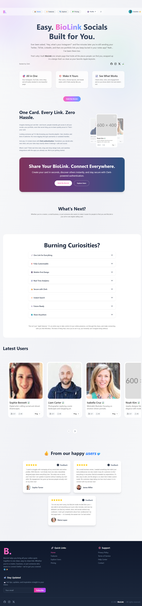
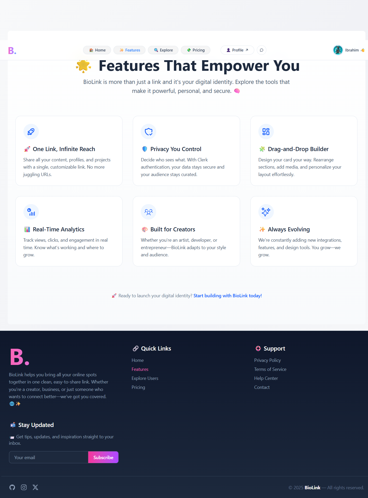
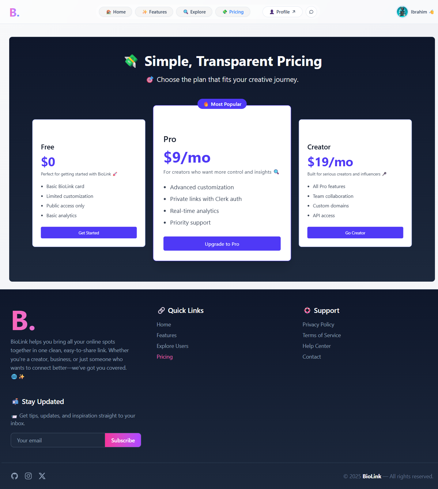

# 🌐 Biolink – Linktree Clone

A sleek and customizable clone of [Linktree](https://linktr.ee), built to help users share multiple links through a single, elegant profile page. Perfect for creators, influencers, and professionals who want to showcase their online presence.









---

## 🚀 Features

- Add unlimited links with custom titles  
- Personalize your profile with themes and colors  
- Upload profile picture and bio  
- Fully responsive design for mobile and desktop  
- Fast and lightweight frontend  
- Secure and privacy-conscious (Clerk auth ready)  

---

## 🛠️ Tech Stack

- **Frontend (client):** React + Vite, Tailwind CSS, React Router  
- **Backend (server):** Express.js + Clerk (auth), REST API  
- **State Management:** React Hooks, Context API  
- **Styling:** Tailwind CSS  

---

## 📦 Installation

### 1. Clone the repository
```bash
git clone https://github.com/your-username/biolink.git
cd biolink
```

```bash
Backend (server)

cd server
npm install   # or yarn
```

```bash
Frontend (client)

cd ../client
npm install   # or yarn
```

```bash
Run Backend (server)

cd server
npm run dev   # or yarn start
```

```bash
Run Frontend (client)

cd client
npm run dev   # or yarn dev
```

### 2. Run Both Together (Optional) 
```json
{
  "name": "biolink",
  "private": true,
  "scripts": {
    "dev": "concurrently \"npm run dev --prefix server\" \"npm run dev --prefix client\""
  },
  "devDependencies": {
    "concurrently": "^8.2.2"
  }
}
```

```bash
biolink/                           # Root project folder
│
├── client/ (frontend)             # Vite + React + Tailwind
│   ├── node_modules/
│   ├── public/
│   │   └── icon.ico
│   │
│   ├── src/                       # React source
│   │   ├── api.js
│   │   ├── index.css
│   │   ├── main.jsx
│   │   ├── App.jsx
│   │   │
│   │   ├── component/             # Reusable components
│   │   │   ├── AccountCard.jsx
│   │   │   ├── Context.jsx
│   │   │   ├── Design.jsx
│   │   │   ├── Footer.jsx
│   │   │   ├── Header.jsx
│   │   │   ├── Loader.jsx
│   │   │   ├── NotFound.jsx
│   │   │   ├── ProductCard.jsx
│   │   │   ├── ProfileForm.jsx
│   │   │   └── SideBar.jsx
│   │   │
│   │   ├── page/                  # Pages
│   │   │   ├── Account.jsx
│   │   │   ├── Explore.jsx
│   │   │   ├── Features.jsx
│   │   │   ├── Home.jsx
│   │   │   ├── Messages.jsx
│   │   │   └── Pricing.jsx
│   │   │
│   │   └── assets/                # Images, fonts, icons, etc.
│   │
│   ├── .env
│   ├── .gitignore
│   ├── eslint.config.js
│   ├── index.html
│   ├── package.json
│   ├── vite.config.js
│   ├── yarn.lock
│   └── README.md
│
├── server/ (backend)              # Express backend
│   ├── .yarn/
│   ├── src/                       # Express routes/controllers
│   │   ├── db.js
│   │   └── index.js
│   │
│   ├── .editorconfig
│   ├── .env
│   ├── .gitattributes
│   ├── .gitignore
│   ├── .pnp.cjs
│   ├── .pnp.loader.mjs
│   ├── package.json
│   ├── yarn.lock
│   └── README.md
│
├── localhost_5173_.png            # Screenshot (preview)
├── .gitignore
└── README.md                      # Root readme
```

---

## 🗺️ Roadmap

- ✅ Add Clerk authentication (sign-in / sign-up)
- ✅ Support custom profile themes
- ✅ Database integration (MongoDB / PostgreSQL)
- ✅ Deploy backend (Render/Heroku) + frontend (Vercel/Netlify)